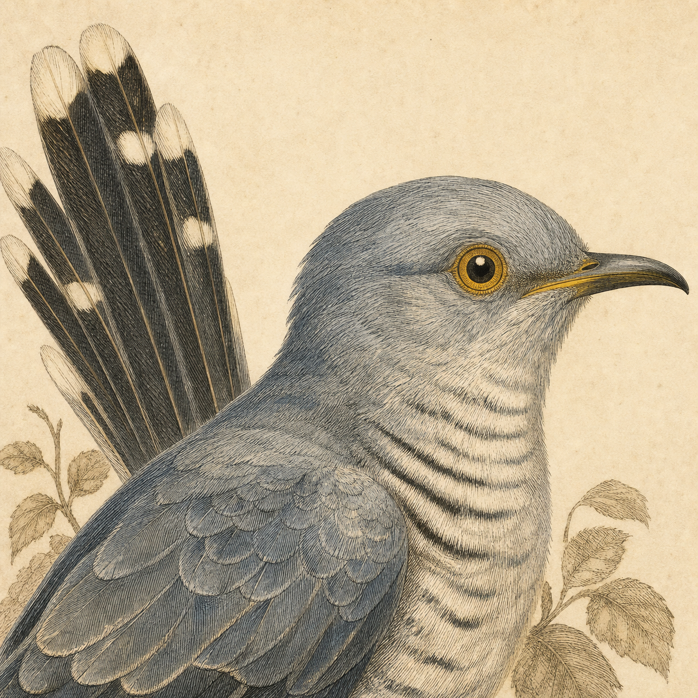

<p align="center">
  
</p>

<h1 align="center">Bugu · 布谷</h1>

<p align="center">
  <strong>为长时间运行的 coding agent 准备的「声音信标」。</strong>
  <br>
  一个原生 macOS 菜单栏小工具：帮你防止 Mac 休眠，并在 agent 开始、完成、
  需要授权、被中断时各发一种声音——这样你可以放心离开屏幕，依然知道 agent 在干嘛。
  <br><br>
  <strong>中文</strong> | <a href="README.en.md">English</a>
</p>

<p align="center">
  <a href="https://github.com/LearnPrompt/bugu/releases/latest"></a>
  <a href="https://github.com/LearnPrompt/bugu/stargazers"></a>
  
  
</p>

<p align="center">
  <a href="https://github.com/LearnPrompt/bugu/releases">下载</a> ·
  <a href="#快速开始">快速开始</a> ·
  <a href="#支持的-agent">支持的 Agent</a> ·
  <a href="#工作原理">工作原理</a> ·
  <a href="#参考与致谢">参考</a>
</p>

---

## Bugu 是什么？

当你把一个长任务丢给 coding agent——Claude Code、Codex、Kimi 等——你要么盯着终端，
要么走开然后失去掌控。Bugu 解决「走开」这一半:它驻留在菜单栏,在 agent 工作时
**保持 Mac 不休眠**,并给每一次状态变化配上**专属的短音效**。你在隔壁房间就能听到
任务结束,瞄一眼菜单,**一键跳回**到对应的终端标签页。

名字取自`布谷`——布谷鸟:平时安静,有变化时才叫一声的小闹钟。

刘海面板类产品(比如 [Vibe Island](https://vibeisland.app/))把可视化控制面板放在屏幕上;
Bugu 走的是**声音优先**路线——这是你在合盖、或视线不在屏幕上时,唯一还能感知的通道。

## 为什么用 Bugu？

- **声音优先** —— 五种可区分的提示音(开始 / 进行中 / 完成 / 中断 / 需授权),不用盯着屏幕。
- **防止 Mac 休眠** —— 用 IOKit power assertion 在 agent 运行时阻止休眠,任务结束后自动释放。
- **原生 + 轻量** —— SwiftUI + AppKit 菜单栏应用,不是 Electron 套壳,无服务器、无账号、无遥测,全部本地运行。
- **多 Agent** —— 识别 20+ coding agent,并可对其中 14 个安装可选 hook,获得即时、准确的事件;多个 agent 同时跑时各自独立追踪。
- **一键跳转** —— 最近会话列表读取本地 transcript,一键跳回到准确的终端标签页。
- **三套音效** —— Apple 系统音、原创 **Bugu Pack**,或你自定义的逐状态组合。

## 支持的 Agent

**Hook 集成(14 个,事件即时且准确):** Claude Code、Codex、Gemini CLI、Cursor Agent、
Trae、Droid(Factory)、Qoder、Qwen、Kimi、Kimi Code、Mistral Vibe、CodeBuddy、WorkBuddy、Kiro CLI。

**额外由轮询自动识别:** OpenCode、Hermes、Pi Agent、Aider、Goose、Amp、Crush、Devin、OpenHands。

<details>
<summary>终端与跳转支持</summary>

| 宿主 | 跳转方式 |
|---|---|
| **Terminal.app** | 按 TTY 精确定位标签页 |
| **iTerm2** | 按 TTY 精确匹配 session |
| **Warp** | 按 hook bridge 写入的 `bugu:<项目名>` 标题 + 辅助功能菜单点击,精确切 tab |
| **Ghostty** | 按标题匹配 + AX raise,精确切 tab |
| **桌面端宿主**(如 Claude.app) | 沿 agent 父进程链找到宿主 GUI 应用并激活 |
| **其它终端/IDE** | 激活正在运行的宿主应用 |

Bugu **只会激活已经在运行的应用**——当它无法定位到准确标签页时,绝不会凭空弹出一个空白终端。

</details>

## 快速开始

### 方式一:下载(推荐)

1. 从 [Releases](https://github.com/LearnPrompt/bugu/releases) 下载最新的 **`Bugu-x.y.z.dmg`**。
2. 打开 DMG,把 **Bugu** 拖进 **应用程序(Applications)**。
3. 由于当前社区版尚未做 Apple 公证,首次打开请**右键 Bugu.app → 打开**,再在弹窗里点**打开**。

> 需要 **macOS 14+**。

如果 macOS 仍然拦截,打开**系统设置 → 隐私与安全性**,选择**仍要打开**;
或在确认来源后清除隔离标记:

```bash
xattr -dr com.apple.quarantine /Applications/Bugu.app
```

### 方式二:源码构建

```bash
git clone https://github.com/LearnPrompt/bugu.git
cd bugu
./script/build_and_run.sh
```

运行单元测试(XCTest 随 Xcode 提供,纯命令行工具没有):

```bash
./script/test.sh
```

> 需要 **macOS 14+** 和 Xcode 命令行工具(Swift 5.10+)。

### 跑起来

1. 点开菜单栏的布谷鸟图标。
2. 打开 **Keep Mac awake** 和 **Watch coding agents**。
3. 选择 **Sound pack** 和 **Alert volume**。
4. 进入 **Manage agents…**,为你常用的 CLI 安装 hook(可一键 *Enable all detected*)。
   所有配置改动都会先备份,可完全撤销。

## 工作原理

```
Coding agent(Claude Code / Codex / Kimi / ...)
  │
  ├── hook 事件 ──▶ bugu-bridge(~/.bugu/bin) ──▶ ~/.bugu/events.jsonl
  │                                                  │ (DispatchSource 实时 tail)
  └── 或 ps/lsof 轮询 ────────────────────────────────┤
                                                     ▼
                                        Bugu(菜单栏应用)
                                         • 播放对应状态的音效
                                         • 持有 IOKit 防休眠
                                         • 列出最近会话
                                         • 点击 → 跳回终端标签页
```

两个事件来源协同工作:**hook** 为你选择安装的 CLI 提供低延迟、准确的状态;
**`ps`/`lsof` 轮询**兜底覆盖其余所有情况。hook bridge 永远 `exit 0`,
绝不阻塞或拖慢你的 agent——即使 Bugu 没在运行,对它们也毫无影响。

<details>
<summary>音效对照表</summary>

| 状态 | 含义 | 系统音 | Bugu Pack |
|---|---|---|---|
| Accepted 开始 | 检测到新的 agent 任务 | Funk | start |
| Running 进行中 | 任务仍在运行(心跳) | Hero | continue |
| Completed 完成 | 任务正常结束 | Blow | success |
| Interrupted 中断 | 任务异常停止 | Basso | end |
| Permission 需授权 | 任务在等你批准 | Ping | need |

原创 **Bugu Pack** 音效为本项目专门制作。Bugu 不复制 Vibe Island、Claude 或 Apple 的音频,也不使用任何语音/TTS。

</details>

## 隐私

一切本地运行。hook bridge 只记录驱动界面所需的最小信息——来源 CLI、事件名、
工作目录、session id、TTY——写入 `~/.bugu/events.jsonl`。不记录 prompt、token、
密钥,无账号、无服务器、无遥测。

## 参考与致谢

Bugu 站在这些前辈和同类工具的肩膀上:

- **[Open Island](https://github.com/Octane0411/open-vibe-island)** —— 开源版的 notch 面板式 agent 监控。Bugu 的会话独立追踪(SessionState 思路)、hook 适配和精确跳转都从它的源码里学到不少。
- **[Amphetamine](https://apps.apple.com/app/amphetamine/id937984704)** —— 经典的 macOS 防休眠工具。Bugu 的「保持唤醒」定位与它同源,但把重心放在「声音 + agent 状态」。
- **[Caffeinated](https://caffeinated.app)** —— 另一款轻量的 macOS 防休眠应用,菜单栏交互值得参考。

Bugu 不复制以上任何项目的代码或音频素材,只借鉴思路。

---

<div align="center">

*合上盖子也安心——让 agent 自己喊你回来。*

</div>

---

<div align="center">

**[LearnPrompt](https://github.com/LearnPrompt) 出品** · 同门手艺

[鲁班·Skill打磨](https://github.com/LearnPrompt/luban-skill) · [庖丁·博主蒸馏](https://github.com/LearnPrompt/paoding-skill) · [蔡伦·对话造纸](https://github.com/LearnPrompt/cailun-skill) · [搭子·结对开发](https://github.com/LearnPrompt/partner-skill) · [愚公·Loop工程](https://github.com/LearnPrompt/loop-engineering) · [阿福·LLM Todo](https://github.com/LearnPrompt/afu-llm-todo) · [AI雷达·零API资讯](https://github.com/LearnPrompt/ai-news-radar) · [淘金小镇·ClawHub日榜](https://github.com/LearnPrompt/skillrush-town) · [Humanize PPT·简报编排](https://github.com/LearnPrompt/humanize-ppt) · [CC Harness·六件套](https://github.com/LearnPrompt/cc-harness-skills)

<sub>公众号「卡尔的AI沃茨」 · [X @aiwarts](https://x.com/aiwarts) · [learnprompt.pro](https://www.learnprompt.pro)</sub>

</div>
